# Design — Broker Research Chatbot

> Setup and run instructions: README. Evaluation evidence: `eval/validation_report.md`.

## 1. The problem, taken seriously

The exemplar question — *"Compare the change in price target for NVDA between UBS's
research and Barclays's research over the past two years"* — has four properties, and
each one defeats naive vector RAG:

| Property | Why naive top-k fails |
|---|---|
| Comparative (two brokers) | Similarity doesn't guarantee covering both sides |
| Temporal ("change over two years") | Embeddings carry no date ordering |
| Aggregative | The answer lives in no single chunk |
| Exact numbers | Price targets sit in sidebars, tables, and **chart pixels** |

So the goal is not "retrieve relevant passages" — it is *reliably answering this class
of question, with verifiable provenance*.

## 2. One-sentence architecture

**Every page becomes "text describing everything on that page," stored in one table;
an LLM loop with two tools queries it; every number in every answer is
deterministically checked back against its cited page.**

Everything else is implementation detail. Stack: Django (ASGI) + Postgres 17 +
pgvector, single LLM vendor (OpenAI Responses API — the only API shape whose
`function_call_output` carries images, verified live). Two Docker services. Three
tables. Two tools. No queue, no reranker, no fact table, no framework.

The same architecture as one picture (red edges mark the agentic decision
surface — where the LLM, not fixed code, decides what happens next):

```mermaid
flowchart TB
    subgraph SEED["OFFLINE — Seeding the knowledge base (runs once)"]
        direction TB
        DOCS[/"30 PDFs · 423 pages"/]
        DOCS --> P0["Parsing:<br/>full-page PNG + native text layer<br/>→ per-page markdown transcription<br/>+ has_visual flag"]
        P0 --> P1["Chunking: none —<br/>one page = one retrieval unit"]
        P1 --> P2["Embedding per page<br/>+ metadata extraction + numeric validation"]
    end

    PG[("Postgres — three tables<br/>Document: broker · date · title · tickers<br/>Page: document_id (→ Document) · page no. · transcription · has_visual · embedding · full-text · png_path<br/>Conversation: id · messages")]
    IMG[("Page-image store (page_assets/) — one PNG<br/>per page, referenced by png_path in Postgres")]

    A(("LLM AGENT<br/>system prompt carries live corpus<br/>boundary + behavior rules"))

    subgraph TOOLS["RETRIEVAL TOOLS — picked by the agent (single or combined)"]
        direction TB
        SP["search_pages — thematic /<br/>specific-fact questions:<br/>hybrid retrieval (semantic + full-text)"]
        LRT["list_reports — comparative /<br/>temporal questions:<br/>exact SQL over metadata (broker/ticker/date …),<br/>all matches guaranteed"]
    end

    U["USER — web chat<br/>text · image · PDF"]

    CK["DETERMINISTIC CHECKS — code-based guardrails:<br/>every number vs its cited page <br/>+ recency labels for superseded reports"]
    FIG["FIGURE LOCATOR — one vision call: locates and<br/>crops relevant figures from cited pages (max 2)"]

    SEED -- "seeding" --> PG
    SEED -- "renders one PNG per page" --> IMG
    U -- "ask a question" --> A
    A -- "tool calls: the agent writes its own<br/>search words, picks the tool, sets filters" --> TOOLS
    TOOLS -- "retrieved results + ORIGINAL page images —<br/>the agent judges and repeats (up to 6 rounds) until enough" --> A
    PG <-- "semantic search /<br/>exact SQL" --> TOOLS
    IMG -. "ORIGINAL page image, fetched via the<br/>png_path on the retrieved row,<br/>attached to tool results" .-> TOOLS
    A -- "draft answer" --> CK
    CK -- "streamed, cited answer + final payload" --> U
    CK -. "only cited pages whose stored<br/>has_visual flag is true" .-> FIG
    FIG -. "cropped figure shown in the answer" .-> U
    SEED ~~~ U

    %% Red edges = the agentic decision surface: outbound, the agent phrases its own
    %% queries, picks tools and filters; on the return, it judges sufficiency and repeats.
    %% linkStyle indexes edges in order of appearance (subgraph-internal edges included).
    linkStyle 6,7 stroke:#EC111A,stroke-width:2.5px;

    classDef user fill:#e8f5e9,stroke:#2e7d32,color:#1f2329;
    classDef tool fill:#fff7e6,stroke:#b45309,color:#1f2329;
    classDef agent fill:#FDF0F0,stroke:#EC111A,stroke-width:2.5px,color:#1f2329;
    classDef store fill:#eef2f7,stroke:#5f6b7a,color:#1f2329;
    classDef det fill:#ffffff,stroke:#0e7a3d,stroke-dasharray:6 4,color:#1f2329;
    classDef llm fill:#FDF0F0,stroke:#EC111A,stroke-dasharray:4 3,color:#1f2329;
    class U user;
    class SP,LRT tool;
    class A agent;
    class DOCS,PG,IMG store;
    class CK det;
    class FIG llm;
```

## 3. Measure first: what the corpus actually is

I measured all 30 PDFs page-by-page before designing (and re-measured after an
adversarial review caught four errors in my own first-round numbers):

- **Metadata must be content-verified, never trusted from filenames.** 423 pages in
  total; the page counts in filenames are systematically wrong (12→6, 18→8, 40→32).
- **Many pages have no text layer, so ingestion must be multimodal to capture
  everything — including what exists only inside images.** 23 of the keynote's 70
  pages have a completely empty text layer and 58 are near-empty; a load-bearing
  `$100T` figure exists only as pixels. Text-only pipelines miss it entirely.
- **Transcribed numbers can be verified deterministically, because broker charts keep
  their numbers in the text layer.** One UBS page carries 417 numeric tokens; the
  check applies to 350 of 423 pages.
- **Render resolution must be computed per page, not set once globally.** Six physical
  page-size classes, and three documents mix sizes internally (one keynote page is
  53.3×30″).
- **Ticker extraction needs a curated alias dictionary, not bare symbol matching.**
  Literal "NVDA" appears in only 21/30 documents — the NVIDIA decks and multi-industry
  reports say only "NVIDIA" — while uppercase "AI" (a real ticker) appears in 29/30.
  Symbols match case-sensitively, company names case-insensitively.
- **The corpus covers 3.5 months, not two years — so declaring the boundary is the
  default behavior.** 2025-06-12 → 09-29, and UBS has a single report. The window is
  injected into the system prompt as fact; the honest answer to the exemplar question
  *declares* it instead of extrapolating.

## 4. The architecture core: chunking, embedding, retrieval — and the rules the model answers under

The pipeline, one row per stage — this table is the design; the subsections after
it hold only what a table cannot (mechanics, verification, rules, security):

| Stage | The choice | Why |
|---|---|---|
| **Parsing** | Every page is **converted into text**: one markdown transcription that describes everything on the page — the prose, the tables (rebuilt as markdown tables), and what the charts show. Two inputs feed a single model call: the rendered full-page image, so vision can read what exists only as pixels, and the PDF's native text layer, so every number stays exactly as printed. | Charts and scanned slides become searchable text without losing exact figures. |
| **Chunking** | None — one page = one retrieval unit. | A broker page is the corpus's unit of self-contained meaning: chart captions live in the prose, table numbers are discussed in the text. Any sub-page cut shatters tables, orphans charts, and breaks page-level citations. Dense-page dilution is covered by the full-text leg — and there is no chunk size to tune wrong. |
| **Embedding** | text-embedding-3-large, one vector per page, at **1,024 dimensions** instead of the native 3,072. | Cross-lingual vector space (measured end-to-end, §4.1). The cut is forced: pgvector's HNSW index caps vectors at 2,000 dims, so 3,072 could not be indexed. It is also cheap in quality — the model is Matryoshka-trained, and the vendor's own benchmarks lose only ~0.5 MTEB point from 3,072 to 1,024 — while the index shrinks to a third. API cost is per token, so this saves nothing on spend; it buys index size and speed. |
| **Storage** | **Two stores.** (1) A relational Postgres database with three tables. **Document** — one row per report: filename, content hash, broker, published date, title, tickers, a ticker→pages map, page count, processing status. **Page** — one row per page: its document and page number, the native raw text, the markdown transcription, `has_visual`, `png_path`, the **embedding** (1024-d vector column), a DB-generated **search_vector** (full text), and suspect-number flags. **Conversation** — one row per chat: id, message history, created/updated timestamps. (2) A page-image store (`page_assets/`): one PNG per page, referenced by `png_path`. | One Page row serves semantic, lexical, and exact-SQL access with zero drift between them; the original pixels stay retrievable for model context, figure crops, and the UI. |
| **Retrieval** | Two tools, chosen by the agent per round: **`search_pages`** — hybrid semantic + full-text search over page transcriptions, for thematic and specific-fact questions; **`list_reports`** — exact SQL over the metadata columns, ordered by date, *all* matches guaranteed, for comparative and temporal questions. | The two tools match the two real question shapes ("find pages about X" / "list exactly these reports in order"); flexibility comes from the agent loop, not a fixed pipeline. |
| **Verification** | Before an answer is shown, every citation is re-checked by code (no LLM): **grounding badge** — the numbers the answer attributes to the cited page are searched for in that page's stored text (found → ✓, not found → ⚠); **recency label** — one SQL query asks whether the same broker has a newer report, and if so the citation is flagged as superseded. | This is the deterministic-checks box in the diagram: a **product feature that runs on every live answer** — distinct from the offline evaluation in §5, which grades the whole system against a golden set. Numbers are trusted because they are checked, not because the model said so. |

**4.1 Retrieval mechanics: the loop is the router.**

- **Two searches run at once, then their rankings are merged.** `search_pages` runs a
  semantic search (vector similarity) and a keyword search (Postgres full text) side
  by side, takes the top 50 from each, and merges them with **Reciprocal Rank Fusion
  (RRF)**: a page scores 1/(k + rank) in each list, and the scores are added. k=10 is a
  weight, not a cutoff.
- **`list_reports` guarantees coverage; `search_pages` goes deep — they work as a
  pair.** `list_reports` lists *every* report matching the broker/ticker/date filter
  (plain SQL, nothing missed) and returns each one's first page as a whole
  transcription — not extracted fields, so the reason behind a rating change is kept
  — plus hints on which other pages mention the ticker. The agent reads those pages
  first; when the answer is not there, it follows the hints into page 2, 3 or deeper
  with `search_pages` (2 of 21 reports need that).
- **The agent routes itself.** Which tool, what wording, which filters, and whether
  to keep searching are the LLM's decisions, guided only by the tool descriptions.
- **Ask in any language.** The model searches in English (the corpus language) and
  answers in the language of the question. Measured, not assumed.

**4.2 Numbers: validated at ingestion, verified at answer time.**

- **At ingestion, transcribed numbers are checked against the page's own text.** A
  small deterministic diff (~20 lines, no API call) flags any number in the
  transcription that the PDF's text layer does not contain. It covers 350 of 423
  pages; its known blind spots are covered by the original-image feedback in §4.3.
- **At answer time, every cited number gets a badge.** Each number in a citation is
  looked up on the cited page: found → ✓, not found → ⚠. A number the model computed
  itself (a percent change, an average) is on no page, so it shows ⚠ on purpose.
- **Superseded reports get a recency label.** One SQL check per citation: if the same
  broker has a newer report, the citation says so — the costliest analyst mistake,
  prevented for free.

**4.3 Charts and figures: the model sees the original page, the user sees the relevant figure.**

- **The agent gets the original page image, not just the transcription.** For pages
  flagged `has_visual`, both retrieval tools attach the page's PNG to their result —
  a transcription can miss a chart detail, and the original image is there to check
  against.
- **After the answer is written, the figure locator looks only at cited pages that
  have visuals — at most two.** One vision call per such page, with three possible
  outcomes: a relevant chart or table is found and cropped out of the page; the whole
  page *is* the figure (a slide) and is shown in full; or no figure is needed and
  nothing is shown — the citation link is enough.
- **If a crop box looks wrong, the whole page is shown instead.** Boxes that are out
  of range, degenerate, or implausibly small or large are rejected, and the fallback
  is the full page. Either way the citation always opens the original PDF at that
  page.
- **The locator only presents figures; it never touches retrieval or the answer.**
  It runs on the interactive path only, never during evaluation, and its output is
  not fed back into later turns.

**4.4 The rules the model answers under: corpus boundary + behavior rules.** 

1. **Corpus boundary** — answer only from the library; never supplement from model
   memory. If the question partly overlaps the covered window, declare the true
   coverage first, then answer the covered part in full. If it does not overlap at
   all, state the boundary and stop — never substitute another year, broker, or
   ticker (at most offer, in one sentence, to answer for what *is* covered).
2. **Table-first** — comparative, time-series, and numeric answers open with a
   Markdown table, one row per broker/date/rating/target, each row carrying its own
   citation, followed by a short synthesis.
3. **No cross-broker blending** — numbers from different brokers are never averaged
   or merged into one figure; every number must trace to a specific broker, date,
   and page.
4. **Cite everything** — every claim carries `[Broker, date, p.N]`, and the numbers
   must come from the cited page.
5. **Follow the recovery path** — if page 1 lacks the needed value, use the
   deep-page hints the tools provide (§4.1).
6. **Named-document pinning** — when the question names a specific document ("the
   keynote", a broker's report of a given date), locate that document via metadata
   first and take numbers only from it — never substitute similar figures from
   another source.
7. **Answer in the user's language** (default: English).

## 5. Evaluation: the method — all numbers live in the report

- **Reference-based.** A 124-item golden set (9 answer-location types × 4
  cross-cutting tags); every expected fact and page was anchored in the PDFs before
  any testing, and each question carries its own grading rule.
- **Two layers.** A retrieval ablation (dense / full-text / hybrid / production-agentic,
  per question type), and an end-to-end behavior validation (correctness, unsupported
  numbers, hallucination, reproducibility, robustness, prompt injection, PII leaks,
  figure crops, multi-turn, attachment input).
- **Methodology reused** from my prior open-source project
  [llm-validation-harness](https://github.com/Nicole-Tu97/llm-validation-harness).
- **All results:** [`eval/validation_report.md`](eval/validation_report.md).

## 6. Simplified for clarity — what was deliberately cut

Every removal traded machinery for legibility; the reversible ones have re-entry
triggers (§8), and two were closed *with data*.

- **No framework** (LangChain/LlamaIndex) — two retrieval tools and three tables do not need an
  abstraction layer over the abstraction layer.
- **No planner layer.** Many agentic-RAG stacks add a separate planning/routing step:
  an extra LLM call that decomposes the question and schedules tools before anything
  runs. Here the function-calling loop *is* the planner — the model already picks the
  tool, writes the query, sets filters, and decides when to stop — so a separate
  planner would add latency and a failure mode without adding capability at this scale.
- **No reranker.** A reranker helps when the right page *is* retrieved but ranked too
  low — say #30 of 50, cut off by the top-10. That is not this corpus's failure
  mode: every miss was the page not being retrieved at all, and production recall is
  already 0.956, so ranking is not the main error source. It earns a place once the
  corpus grows and near-identical pages multiply.
- **No pre-extracted facts table** — exact SQL over metadata plus full first-page
  context answers comparative/temporal questions without a lossy second store.
- **No sub-page chunking.** Chunking splits a page into smaller passages for finer
  retrieval. Here the page itself is the unit of meaning (§4, Chunking row), so
  splitting would only break tables and page-level citations.
- **No Celery/Redis queue.** A task queue runs work in the background — many PDFs in
  parallel, automatic retries. Thirty documents are imported once, in one process;
  the infrastructure would cost more to run than it saves.
- **No Batch API.** OpenAI's offline batch endpoint processes bulk requests at half
  price, hours later. Measured, not assumed: 423 pages of base64 PNG exceed its
  200 MB input cap, so the ~$12 saving would have bought a second code path.
- **No prompt-caching engineering.** The system prompt (our fixed instructions, not
  the user's question) can be cached by OpenAI at a discount. It is only ~5% of spend;
  the other ~95% is what the agent reads per question — page transcriptions and,
  above all, the attached page images — which changes every time and cannot be cached.
- **No frontend framework.** React and similar frameworks manage complex interactive
  UIs. A single chat page with streaming and citation cards is served fine by one
  Django template and plain JavaScript.

Several of these are reversals of my own earlier designs — the details are in §7.

## 7. What I tried that didn't work — and what fixed it

Every item below followed the same loop: try → measure → root-cause → fix →
re-verify. The failures stay on the record deliberately — they are where the design
earned its shape.

**1. Keyword search demanded every word to match — so real questions matched almost nothing.**

- *What happened:* **Keyword search found almost nothing.** The full-text leg scored
  0.094 recall on 94 items, and its noise votes slightly hurt the fused result.
- *Why:* **AND matching required every word to be on the same page.** No page
  contains every word of a long natural-language question, so long questions matched
  nothing.
- *The fix:* **Match on any word, then rank.** OR matching, with pages ranked by how
  many of the words they contain and how rare those words are.
- *Verified:* **Keyword recall 0.094 → 0.681; hybrid 0.761 → 0.814.** The behavior
  round re-passed at a third of the previous cost ($2.43 vs $7.17) because the agent
  now lands on the right page in fewer rounds.

**2. Every citation used to ship a full-page screenshot.**

- *What happened:* **Every cited page came with a screenshot.** Early answers embedded
  a screenshot of every cited page — the cover page of a text report included.
- *Why:* **More images is not more context.** Irrelevant images dilute the answer and
  add nothing an analyst can use.
- *The fix:* **A `has_visual` flag at parsing time, and a figure locator built on it.**
  At parsing time the model now marks every page with a `has_visual` flag — does this
  page carry a chart, table or image? — stored on the Page row. On that flag sits the
  figure locator (§4.3): only cited pages flagged `has_visual` are examined, and for
  those it crops the specific chart, embeds the whole page when the page *is* the
  chart, or attaches nothing when the answer is summarizable from text. Pages that
  should deliver a figure do; pages that should be summarized are.
- *Verified:* **Figure-crop accuracy 0.824 and 0.80 across two full runs.** The
  metric exists to keep exactly this honest.

**3. One question cost $4.85.**

- *What happened:* **One date-filtered question burned 13 futile tool calls.**
- *Why:* **Undated documents silently vanish behind a date filter.** NVIDIA's own
  decks (the keynote, the quarterly presentations) carry no publication date — not in
  the filename, not on the page — so their `published_date` is empty in the database.
  A date filter is a SQL range check, and an empty date never falls inside a range,
  so those documents dropped out of every filtered search. The tool just returned "no
  results"; the agent read that as bad wording and kept re-phrasing — while
  re-attaching the same page images every round (115 attachments for 37 distinct
  pages).
- *The fix:* **The tool now says what it excluded.** It reports when a date filter
  excluded undated documents, so the agent drops the filter and retries; images are
  deduplicated within a turn; the cost footer prices cached tokens correctly.
- *Verified:* **Same-shape questions returned to normal cost.** The live footer keeps
  every answer's spend visible.

**4. Asked about 2023, the bot answered with 2025 data.**

- *What happened:* **Asked about 2023, the bot served the 2025 data it had.** A real
  user asked for NVDA's 2023 target trajectory.
- *Why:* **"Be helpful" beats "stay in scope" unless the boundary is an explicit
  rule.**
- *The fix:* **An explicit overlap rule.** Rule 1 in §4.4 — declare-then-answer on
  partial overlap, state-and-stop on zero overlap. The first version of the fix
  regressed elsewhere; the behavior suite caught that too.
- *Verified:* **0 of 15 unanswerable questions answered.** The user's exact question
  entered the golden set.

**5. One hard question failed three different ways.**

- *What happened:* **The keynote's "$100T market" question failed three times, each
  a different defect,** when asked in adversarial wording.
- *Why and the fixes, one per defect:*
  - **Giving up when the rounds ran out.** The agent returned "please narrow your
    question" — $1.25 for a give-up message. Now hitting the round cap forces one
    final, tool-free, best-effort answer: a give-up message is strictly the worse
    output.
  - **Searching in analyst vocabulary, not the slide's own words.** The model searched
    for "market size" and "TAM" while the slide's transcription holds only the page's
    words. The tool description now says: search slide-style content with the page's
    own words, and after a miss re-word drastically instead of tweaking synonyms.
  - **Answering from a nearby source.** Re-worded, the model found a similar-looking
    real number (~$100 *billion*, a broker's European-capex figure) in an adjacent
    document and answered with it. Behavior rule 6 (named-document pinning, §4.4) now
    forbids substituting a nearby source for the named one.
- *Verified:* **The question now answers $100 trillion, citing the keynote page.** The
  whole pure-chart category passes end-to-end.

**6. The grading script itself judged some correct answers wrong.**

- *What happened:* **Four scorer blind spots each marked a correct answer wrong,**
  surfacing only at 124-item scale.
- *Why:* **Literal matching is strict by design.** Locale-specific numeric scale
  words, the multiplication sign, page numbers inside citation labels counted as
  numeric claims, and follow-up answers citing pages from conversation memory marked
  unverifiable (that last one was also a product defect — follow-ups showed a
  warning badge).
- *The fix:* **Each blind spot fixed and pinned with a regression test** that replays
  the once-misjudged example; the memory case also fixed in the chat loop.
- *Verified:* **Stored answers were transparently rescored.** The rule change is
  public in the code, not a quiet grade bump, and the regression tests keep the fixes
  from silently un-fixing.

## 8. Known limits and future directions

**Limits:**

- **A 3.5-month corpus window.** Coverage runs 2025-06-12 to 2025-09-29; the system
  declares this boundary rather than extrapolating beyond it.
- **No live market data.** Answers stop at the corpus — the newest fact is dated
  2025-09-29, so "today's price" is out of scope by design.
- **Targeted questions, not corpus-wide analytics.** Retrieval returns the
  top-ranked pages, so "summarize all 30 reports" or "count every mention across
  423 pages" exceeds the tool budget.
- **Original figures only.** It reproduces charts from the reports; it does not
  draw new ones — ask for a chart of the price-target trajectory and the answer is
  a cited table.
- **A single running conversation.** A refresh starts a new chat; there is no
  conversation list to switch or resume, and nothing carries over between
  conversations. (Transcripts are stored in the database; what is missing is the
  management UI.)
- **Verification covers numbers, not prose.** The badge can prove a cited number
  exists on the page; a qualitative claim ("management sounded confident") has no
  mechanical check and rests on the model's faithfulness alone.
- **Answers take seconds, not milliseconds.** A question can run up to six tool
  rounds; latency and cost are shown live under every answer rather than hidden.

**Future directions — four tracks:**

- **Smarter retrieval, from our own data.**
  - Keep the single-shot hybrid results as a floor (deep-page recovery: agentic
    0.818 vs hybrid 0.909), or route by question type — the agent's choices can
    then only add pages, never lose them.
  - The general version is a thoroughness dial: today the agent stops when it
    judges the evidence sufficient; when accuracy outweighs cost, collect
    candidates exhaustively and let verification decide what enters the answer.
  - Routing also cuts latency — simple lookups skip the agent rounds.
  - A reranker joins only if the miss profile changes (candidates present but
    misranked); today every miss is candidate absence, which reranking cannot fix.
- **Freshness and scale.**
  - Ingestion is idempotent: a scheduled job keeps the corpus current at
    ~$0.055/page (live market quotes stay a separate data-feed concern).
  - At thousands of documents, the measured migration points fire in order: an
    ingestion queue, object storage for page images, per-language full-text
    configs, a dedicated lexical engine, and a structured facts table once
    `list_reports` matches exceed ~50 reports (below that, full first-page
    context wins).
  - Precomputed per-document rollups — one offline summary per report, built at
    ingestion — turn corpus-wide questions ("summarize all 30 reports") back into
    retrieval questions.
  - Production deployment adds auth and per-client isolation first, then re-adds the §6
    cuts as their triggers fire; operational detail lives in the README under "Adding
    more documents".
- **Wider verification, richer answers.**
  - Extend the badge to prose: require a short verbatim quote per qualitative
    claim and string-match it against the cited page — still no LLM judging an LLM.
  - Draw simple derived charts (a price-target trajectory line) from numbers that
    are already verified.
  - Add a conversation list/resume view — transcripts are stored; only the UI is
    missing.
- **A deeper golden set.**
  - More items in every category tightens the error bars and surfaces rarer
    failures.
  - The grading rules are settled, so growing the set is data entry, not code.
